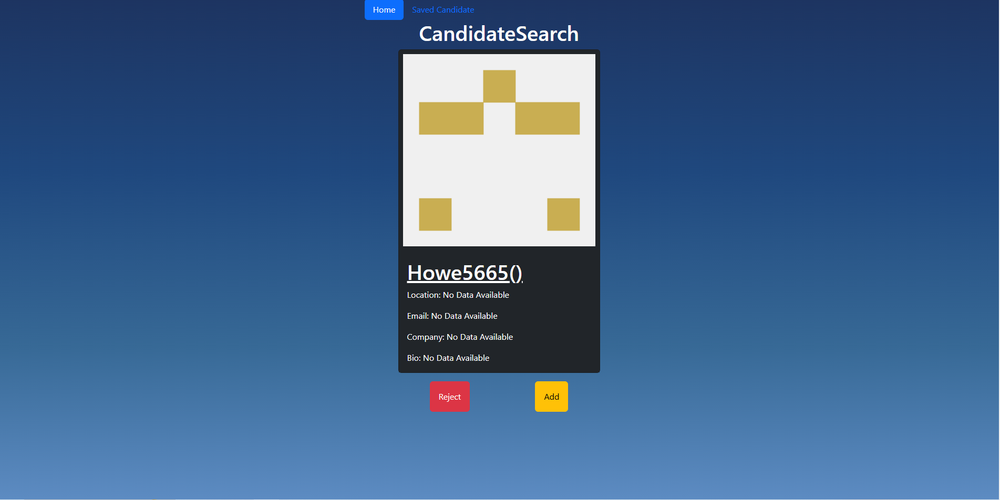
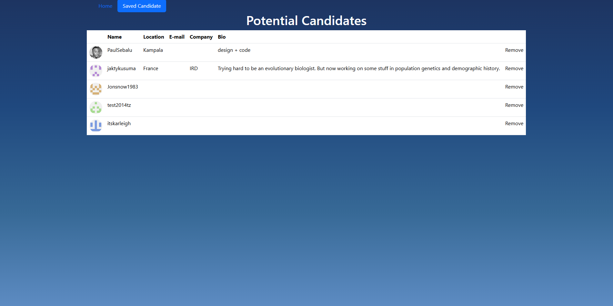

# Candidate Search


## Description

- **Motivation**: The main motivation behind building this project was to provide a simple, interactive platform for searching and saving candidate information. As a developer, this project helped reinforce key concepts such as React component lifecycle, state management, local storage integration, and the importance of separating UI and business logic. Additionally, it's a great exercise to understand how to create dynamic UIs that react to user input.
- **Why build This Project**: React Fundamentals: Working with useState, useEffect, and handling user input.State Management: Storing data locally using Local Storage to persist user actions even after a page reload.UI Design: Displaying information in a user-friendly, clean card format.Performance Optimization: Storing data on the client-side with Local Storage to improve user experience.Additionally, building this project was an opportunity to learn more about handling API requests, managing data flow in a React application, and making sure that components stay reusable and modular.
- **What problem's did it solve**: User Data Management: Users can search for candidates, view their information, and save them to a list that is persistent across page reloads.Data Persistence: By using Local Storage, I was able to ensure that the saved candidates' data stays intact even when the user navigates away or refreshes the page.Efficient Display: I used cards to display user information in a clean, easy-to-read format, making the UI both functional and user-friendly.
- **Lesson's Learned**: React State Management: I deepened my understanding of how React's state works (useState) and how data can be passed through props to child components.Handling User Interactions: By integrating a feature to save candidates, I learned how to react to user actions and make updates to the UI dynamically.Local Storage: I learned how to integrate Local Storage in a React app, which was a useful tool to persist user data even after page reloads.Conditional Rendering: The project helped me understand how to show certain UI elements conditionally based on the data available (e.g., showing the "No Data Available" message when there are no saved candidates).
- **What makes your project stand-out**: This project leverages Local Storage to persist user-selected candidate data, which ensures that the candidates saved by the user are still available even after the page reloads or a user navigates away. This feature makes the app more useful and functional as it retains data across sessions without the need for an external database.

## Table of Contents

- [Installation](#installation)
- [Usage](#usage)
- [Credits](#credits)
- [License](#license)
- [Features](#features)
- [How to Contribute](#how-to-contribute)
- [Tests](#tests)
- [Questions](#questions)
- [Snapshot](#snapshot)
- [Links](#links)

## Installation
```
git clone git@github.com:sidhuad/CandidateSearchReactApp.git 
npm install
npm run start
```

## Usage
The main page displays candidate search functionality where you can search for candidates based on some predefined criteria (e.g., name, location, etc.). The results will be displayed as cards showing basic information such as name, location, and email.By clicking the "Save" button on any candidate's card, the candidate will be added to the "Saved Candidates" page, which is stored locally in the browser's Local Storage. This allows you to persist the data even after a page refresh.Navigate to the "Saved Candidates" page to view all candidates that have been saved. This page retrieves the data from Local Storage and displays it dynamically.

## Credits
Fork the repository push changes.

## License
A short and simple permissive license with conditions only requiring preservation of copyright and license notices. Licensed works, modifications, and larger works may be distributed under different terms and without source code. https://choosealicense.com/licenses/mit/

## Features
- Users can add candidates to their "Saved Candidates" list.This feature utilizes Local Storage to persist saved candidates even after the page is refreshed or the browser is closed.The list of saved candidates can be viewed on a separate page or section of the app.Users can remove candidates from the saved list, and the change is reflected in real-time.This offers flexibility to manage the list of saved candidates.
- Future feature: Allow users to log in and have their own personal saved candidates list, stored in a backend database rather than Local Storage.Benefit: This would make the app more versatile, allowing multiple users to interact with it and maintain separate saved lists.Future feature: Add sorting options (e.g., by name, location, experience, etc.) or the ability to rank candidates based on specific criteria.

## How to Contribute
Fork the repository and push the changes, can contact me for any questions or bug reports

## Tests
```
npm run test
```

## Questions
- For Further Questions and Bug reports Please reach out to me at Github [sidhuad](https://github.com/sidhuad) or email me at adarshsidhu83@gmail.com

## Snapshots




## Links
[Site Deployed link](https://github-candidate-search-p20n.onrender.com/)<br>
[Github Repo](https://github.com/sidhuad/CandidateSearchReactApp)